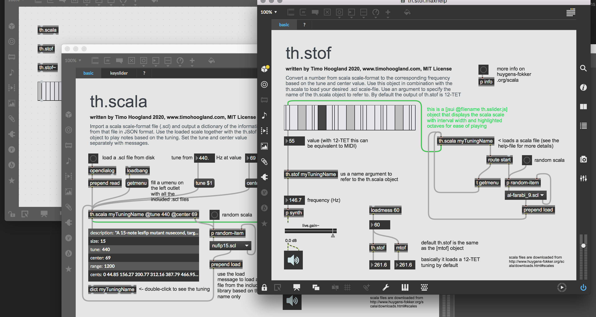

# th.scala

A set of abstractions that allow you to explore alternative and microtonal tunings with MaxMSP. Import scala (.scl) files, display them on a custom keyslider (instead of the piano kslider) and convert note-numbers to frequencies in the data or signal domain.

## IF YOU MAKE USE OF MY CODE ON A REGULAR BASIS

**Consider to [name a fair price](http://gumroad.com/tmhglnd)**

**or [become a patron](http://patreon.com/timohoogland)**

---

## About



## Contains

- **th.scala**

Import a scala scale-format file (.scl) with the `(read $1)` message and output a dictionary of the information from that file in JSON format (useful with the [dict] object). Give the object a name as first argument and use that to refer the to with the `[stof]` and `[stof~]` objects. Use the loaded scale to play notes based on the tuning. Set the tune and center value separately with messages `(tune $1)` and `(center $1)` or via attributes `@tune` and `@center`. When loading a 12-TET tuning, setting `@tune 440` and `@center 69` makes the object behave like a regular `[mtof]` object. Load the entire scala file list into a *umenu* object with `getmenu` (downloaded from [huygens-fokker.org](http://www.huygens-fokker.org/scala/)).

- **th.stof**

Convert a number from scala scale-format to the corresponding frequency based on the tune, center and cents value. Use this object in combination with the `[th.scala]` to load your desired (.scl) scale-file. Use an argument to specify the name of the `[th.scala]` object to refer to. By default the output of th.stof is 12-TET so it behaves similar to the `[mtof]` object.

- **th.stof~**

Similar as the `[th.stof]` object, except it works in the signal domain.

- **th.sslider.js**

A custom *jsui* file that shows a kslider-like object to allow for playing with the custom tuning files. The keys are displayed side-by-side (no black keys), and their width denote the relative interval. A light-gray key denotes the octaves. The sslider works with velocity as well and in `mode 2` it behaves as touchscreen (generating note-off). Unsupported yet is polyphonic mode.

## Install

```
1. download zip
2. unzip and place in Max Library (on MacOS ~/Documents/Max 8/Library)
3. restart Max8, open a new patcher
```

```
1. open terminal
2. $ cd ~/Documents/Max\ 8/Library
3. $ git clone https://github.com/tmhglnd/th.scala.git
4. restart Max8, open a new patcher
```

# License

MIT License

This program is distributed in the hope that it will be useful,
but WITHOUT ANY WARRANTY; without even the implied warranty of
MERCHANTABILITY or FITNESS FOR A PARTICULAR PURPOSE. See the
GNU General Public License for more details.
